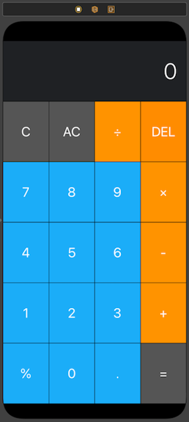

# Calculator_iOS
Calculator iOS APP native

Applying the concepts:

* IBOutlets & IBActions
* Randomisation
* Motion Detection
* AutoLayouts

# Funcinality
This App is a basic calculator

## Portrait

## Landscape
